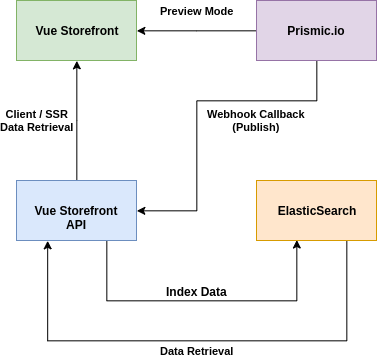

# Vue Storefront API Prismic Extension

**[** WORK IN PROGRESS **]**

This is the Vue Storefront API part (extension) of the Prismic integration. It requires the [Vue Storefront counterpart (module)](https://github.com/butopea/prismic-vue-storefront) to work.  

## Data Flow



## Features (Vue Storefront API)

- [X] Public and private (via access tokens) API support
- [X] Webhook sync callback support (on publish)
- [X] ElasticSearch data cache
- [X] Content retrieval based on ID/UID, custom types, tags, filters, and languages
- [ ] Document search
- [ ] CLI sync script (cronjob)

## Installation (Vue Storefront API)

Run this command in the VSF API root folder to install the Prismic extension: 

```shell script
git submodule add git@github.com:butopea/prismic-vue-storefront-api.git src/api/extensions/
```

Add the following block to your configuration file (config/local.json):

```json
"prismic": {
  "apiEndpoint": "https://<YOUR_PRISMIC_REPO>.prismic.io/api/v2",
  "accessToken": "",
  "webhookSecret": "",
  "cmsBlockEntityType": "cms-block",
  "cmsPageEntityType": "cms-page",
  "indexToLocale": [
    { 
      "index": "vue_storefront_catalog",
      "language": "en-gb"
    }
  ],
  "retrieveItemIfNotCached": true,
  "syncPageSize": 20
}
```

## Configuration explanation
* `apiEndpoint`
  - Name of your Prismic repository (keep the rest of the URL the same, especially `/api/v2`).
* `accessToken`
  - If you have set up your Prismic repository with a private API, you need to add a new permanent access token and set it here.
* `webhookSecret`
  - The secret passphrase sent by Prismic with each webhook callback.  
* `cmsBlockEntityType`
  - The type name given to your CMS block content types on Prismic.
* `cmsPageEntityType`
  - The type name given to your CMS page content types on Prismic.
* `indexToLocale`
  - Contains a mapping of each ElasticSearch index to its document language.
* `retrieveItemIfNotCached`
  - If the requested item (page/block) is not cached in ElasticSearch, the extension will attempt to load it from Prismic and store it in the database.
* `syncPageSize`
  - Number of pages to retrieve per request during the sync (default: `20`, maximum: `100`)
## Credits

Made with ❤ by [Butopêa](https://butopea.com)

Based on:

* https://github.com/kodbruket/vsf-storyblok-sync
* https://github.com/Agence-DnD/vue-storefront-api-prismic-connector
* https://github.com/BartoszLiburski/vsf-prismic-api

## Support

Please ask your questions regarding this extension on Vue Storefront's Slack https://vuestorefront.slack.com/ You can join via [this invitation link]((https://join.slack.com/t/vuestorefront/shared_invite/enQtNTAwODYzNzI3MjAzLWFkZjc0YjVjODA1Y2I2MTdlNmM0NThjY2M5MzgzN2U2NzE4YmE2YzA4YTM0MTY3OWQzZjBhMjBlZDhmYjAyNGI)).

## License

This extension is completely free and released under the MIT License.
